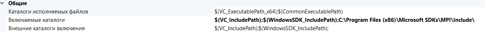
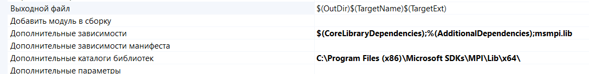
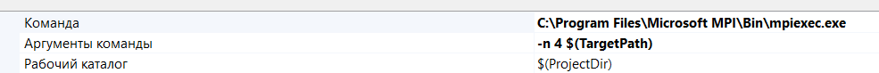

# Лабораторные работы по курсу Параллельное программирование
___
## Инструкция по запуску MPI программ
### Visual Studio

***
1. Установить последнюю версию MPI для Windows (msmpisdk.msi и msmpisetup.exe); последняя версия доступна на сайте Microsoft
2. Создать проект в Visual Studio
Проект -> Свойства -> Каталоги VC++
   * В строке «Включаемые каталоги» добавить путь к заголовочному файлу mpi.h (```C:\Program Files (x86)\Microsoft SDKs\MPI\Include\```)
    

3. Проект -> Свойства -> Компоновщик ->Все параметры
   * В строке «Дополнительные зависимости» добавить ```msmpi.lib```
   * В строке «Дополнительные каталоги библиотек» добавить путь к msmpi.lib (```C:\Program Files (x86)\Microsoft SDKs\MPI\Lib\x64\``` для 64 битной ОC)


4. Проект -> Свойства -> Отладка
   * В строке «Команда» добавить путь к файлу mpiexec.exe (```C:\Program Files\Microsoft MPI\Bin\mpiexec.exe```)
   * В строке «Аргументы команды» добавить ```-n 4 $(TargetPath)```, где 4 – число запускаемых процессов



***
## Инструкция по запуску OpenMP
1. Проект -> Свойства -> Общие
   * В строке «Стандарт языка С++» выбрать ```Стандарт ISO C++ 20 (/std:c++20)```
2. Проект -> Свойства -> C/C++ -> Язык
   * В строке «Поддержка Open MP» выбрать ```Да```
   * В строке «Стандарт языка С++» выбрать ```Стандарт ISO C++ 20 (/std:c++20)```


## Инструкция по запуску проекта

* Запустить lab1.1.sln
* После настройки проекта достаточно добавить один из файлов *.сpp в  ```Исходные файлы```
> Примечание:
> Стоит исключать прошлые файлы и добавлять новые, чтобы программа запускалась